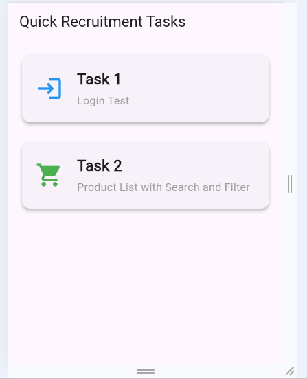
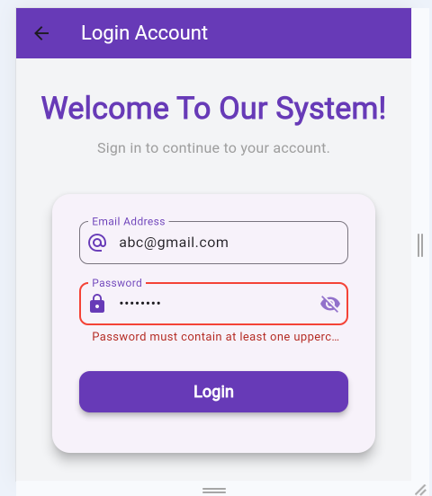
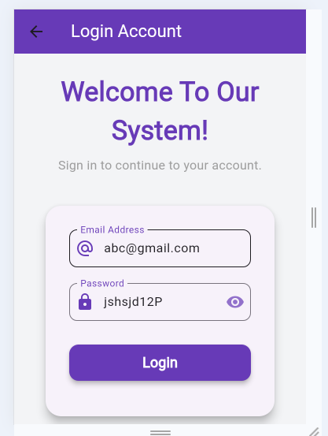

## 🖼️ Module Screenshots Overview

The paths have been updated to reflect the structure: `screenshots/task1/filename.PNG`.

| Screenshot | File Name | Image | Description |
| :--- | :--- | :--- | :--- |
| **Home Page** | `homePage.PNG` |  | The main view with a sidebar for easy navigation to all sub-modules. |
| **Login Page** | `loginPage.PNG` |  | The screen for administrator login and account management. |
| **Valid Email Test** | `validEmailTest.PNG` |  | Shows the validation test for organizational email addresses. |
| **Daily Attendance** | `passwordValidation.PNG` |  | Displays records of daily employee attendance (check-in/check-out). |
| **Designations** | `validPasswordVisibility.PNG` |  | Lists all job roles or titles within the organization. |
| **Employee List** | `successfulLogin.PNG` |  | Directory of all active employees with basic details. |
