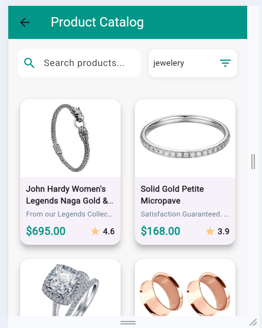
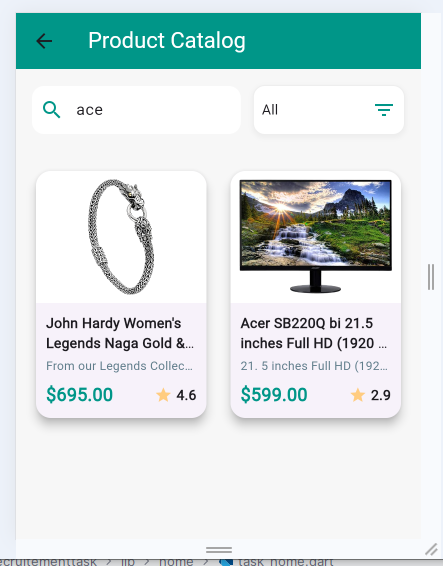
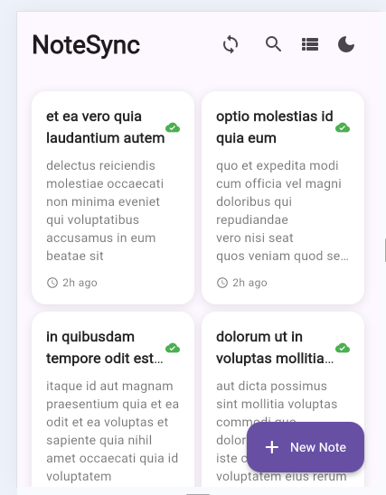
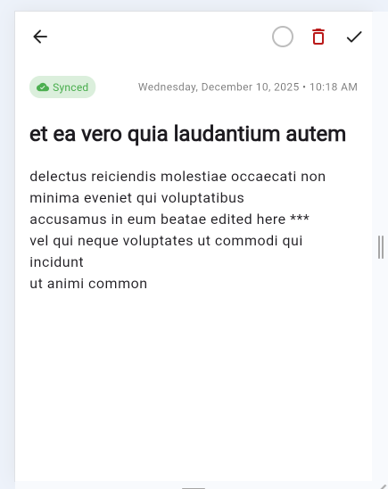
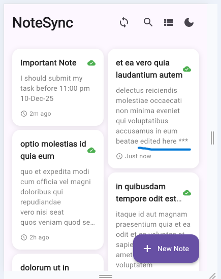

 
## 🖼️ Module Screenshots Overview : Task 1

The paths have been updated to reflect the structure: `screenshots/task1/filename.PNG`.

| Screenshot | File Name | Image | Description |
| :--- | :--- | :--- | :--- |
| **Home Page** | `homePage.PNG` |  | The main view with a sidebar for easy navigation to all sub-modules. |
| **Login Page** | `loginPage.PNG` |  | The screen for administrator login and account management. |
| **Valid Email Test** | `validEmailTest.PNG` |  | Shows the validation test for organizational email addresses. |
| **Password Validation Test** | `passwordValidation.PNG` |  | Displays Password Validation. |
| **Password Visibility Test** | `validPasswordVisibility.PNG` |  | Password Visibility. |
| **Successful Login** | `successfulLogin.PNG` |  | Successful Login. |

## 🖼️ Module Screenshots Overview : Task 2

The paths have been updated to reflect the structure: `screenshots/task2/filename.PNG`.

| Screenshot | File Name | Image | Description |
| :--- | :--- | :--- | :--- |
| **Fetch All Products** | `fetchAllProduct.PNG` |  | Displays all products in the system with options to view details. |
| **Search by Category** | `searchByCategory.PNG` |  | Allows searching products by their category. |
| **Search by Category & Title** | `searchByCategoryAndTitle.PNG` |  | Allows searching products using both category and title filters. |
| **Search Only by Title** | `searchOnlyByTitle.PNG` |  | Allows searching products using only the title. |

## 🖼️ Module Screenshots Overview : Task 3

The paths have been updated to reflect the structure: `screenshots/task3/filename.PNG`.

| Screenshot | File Name | Image | Description |
| :--- | :--- | :--- | :--- |
| **All Notes (Light Mode)** | `all product in light mode.PNG` |  | Displays all notes in light mode with options to view details. |
| **All Notes (Dark Mode)** | `all product in dark mode.PNG` |  | Displays all notes in dark mode for better visual contrast. |
| **All Notes (Dark Mode with Row Card)** | `all product in dark mode with row card.PNG` |  | Displays notes in dark mode using a row card layout for easier browsing. |
| **Search Notes** | `searching.PNG` |  | Shows the search functionality for filtering notes by category and/or title. |
| **Offline Pending Sync** | `offLinePendingSync.PNG` |  | Displays notes that are pending sync while offline. |
| **After Syncing** | `afterSyncing.PNG` |  | Shows updated notes after syncing changes. |
| **Editing Note** | `doingEdit.PNG` |  | Shows the process of editing a note. |
| **Edit After Syncing** | `editAfterSyncing.PNG` |  | Displays the edited note after syncing changes. |

